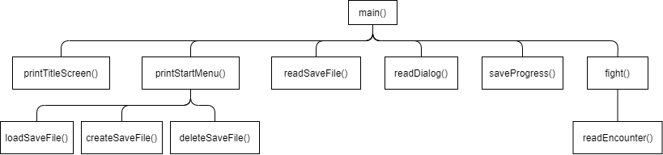
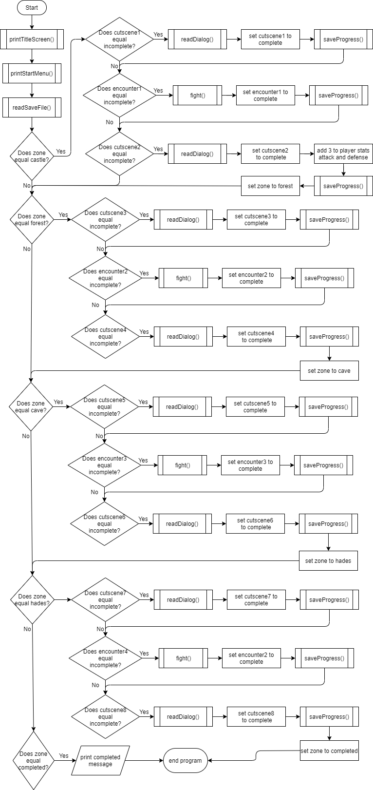

# IntroProgrammingFinalProject
##Hierrachy Chart

##Flowchart

##Psuedocode
Code starts
Call print title screen function
Call print start menu function
Call read save file function
Check what zone the player is in
Check what cutscene or encounter the player is in
Start from that cutscene or encounter
Call read dialog or fight functions
Update which cutscene or encounter the player is in
Update zone between cutscene and cutscene
Save the data to the save file between cutscenes and/or encounters
continue through cutscenes and encounters until zone is "completed"
##IPO Table
| Function | Input | Processing | Output | 
|----------|-------|------------|--------|
| printStartMenu() | choice | look at which choice was selected (1, 2, or 3) | go to the appropriate function |
| loadSaveFile() | name of the file | make the name lowercase, then check if it's a real file | return validated file name or ask user to try again |
| createSaveFile() | name for a new file | make the name lowercase, then check if it already exists | create a new file, or ask the user if they want to overwrite the file with the same name. Exit the program |
| deleteSaveFile() | name of a file | make the name lowercase, then check if it's a real file | delete the file if it exists. Exit the program |
| readSaveFile() | zone | validate that the zone is set to a valid word | return zone |
| readSaveFile() | completedCutscenes | convert into dictionary, validate keys and values | return completedCutscenes |
| readSaveFile() | completedEncounters | convert into dictionary, validate keys and values | return completedEncounters |
| readSaveFile() | playerStats | convert into dictionary, validate keys and values | return playerStats |
| readDialog() | line | strip, look for keywords | print line in the way the keywords indicate |
| saveProgress() | The file name and the variables and dictionaries returned by readSaveFile() | break into lines | updated save file |
| encounterReader() | line | strip, look for keywords and make two dictionaries (enemyDialog and enemyStats), validate the values in enemyStats | return dictionaries |
| fight() | the dictionaries returned by encounterReader(), playerStats, user choices | create temp stats for player and enemy | print a unique fight sequence |

